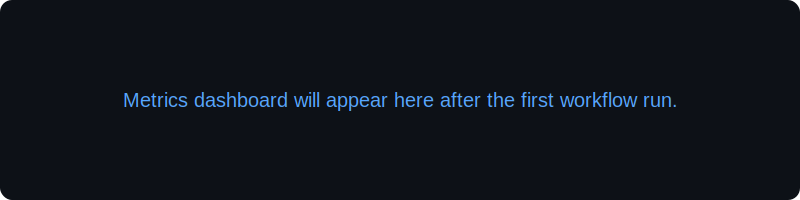

# 记得晚安 · JDWA

> 全栈技术开发者 · 系统级解决方案提供者

  

## 👨‍💻 个人简介
「每一行代码都是为了活着！」

- 2022 年投身计算机专业，最初因 CS / PUBG / APEX 等游戏对内存管理与系统底层技术产生兴趣。
- 2023 年开始研究 memflow、qemu-kvm 等虚拟化与内存分析技术，搭建高性能虚拟化环境并实现系统级应用，掌握 KVM 反检测与多系统互操作方案。
- 2024 年紧跟 FPGA-DMA 趋势，开展固件仿真与 kmboxnet / kmboxb 技术实践，为游戏主播及企业项目提供系统级编程支持。
- 目前聚焦企业级项目研发，深入学习 Rust、Go 等现代系统语言，持续输出高可靠、高性能的工程方案。

## 🧠 核心能力地图
- **硬核技术栈**：Java / Python / Rust 全栈开发，Spring Cloud + Vue 前后端分离架构
- **系统级突破**：KVM 反虚拟化、DMA 固件定制、显卡直通、内核级虚拟化对抗
- **问题终结者**：性能瓶颈诊断、内存管理优化、高并发系统设计与故障恢复
- **定制化服务**：特定技术需求的快速验证与交付，为主播及企业提供专属技术支持

### 🔧 常用技术图标

  
  
  
  
  
  
  
  
  
  
  
  
  
  
  

## 💼 技术栈
| 模块 | 能力要点 |
| --- | --- |
| 开发语言 | Java (Spring Boot / Spring Cloud)、Python (Django / Flask)、JavaScript / TypeScript (Vue / React)、Rust、C/C++ |
| 数据与缓存 | MySQL、PostgreSQL、MongoDB、Redis |
| 系统技术 | Linux 管理、KVM 虚拟化、内核开发与调试、DMA / 固件开发 |
| 工具链 | Docker / Compose、GitHub Actions、Ansible、Grafana / Prometheus |

## 🏗️ 代表项目
<!--projects-start-->
| 项目 | 功能概述 | 核心技术 |
| --- | --- | --- |
| [Virtual-Core Lab](https://github.com/AAASS554) | 虚拟化实验环境与 memflow 自动化分析工具包 | Rust / Python |
<!--projects-end-->

> 如需项目演示或协同开发，请通过下方联系方式获取详细资料。

## 🤝 开源与社区贡献
- 在 GitHub 上持续更新虚拟化与系统级工具脚本，分享 KVM 反检测与内核调试经验
- 为 memflow / qemu 社区提供问题复现与文档优化建议，推动国内开发者了解相关生态
- 通过 Issue / Discussion 形式输出诊断思路，帮助更多开发者规避虚拟化与 DMA 实践中的坑位

## 📊 GitHub 数据看板
<!--stats-start-->

<!--stats-end-->

> 所有统计数据由自托管脚本生成，并结合 GitHub Actions 定时刷新确保稳定。

## 🏅 GitHub 成就

  

## 🌱 活动轨迹

  

## 🧩 Summary Cards

  

  
  

## 📈 Metrics Overview

  

## 🐍 Contribution Snake

  

## 📰 最新动态 / 博客
<!--blog-start-->
正在开发「AI 模型调度平台」，聚焦统一代理多家模型 API、Key 管理与观测。
<!--blog-end-->

## 🚀 AI 模型调度平台速览
- **目标**：托管 CC/Codex/Gemini 等模型 API Key，提供安全代理、日志与限流能力，配合 React 控制台完成配置与监控。
- **架构**：`admin-ui (React+Vite)` ↔ `gateway-service (Spring Boot WebFlux)`，可选 `shared-core` 输出 Provider SPI/DTO；坚持 KISS/YAGNI，不拆微服务。
- **后端栈**：Java 17、Spring Boot 3、Spring Security + JWT、Spring Data JPA + PostgreSQL、Redis + Resilience4j、Micrometer、springdoc-openapi；`AiProviderClient` SPI + `CredentialService` 加密，路由策略/日志用 AOP 复用（DRY/SOLID）。
- **前端栈**：React 18 + TypeScript、Ant Design、React Query、React Hook Form；OpenAPI codegen 对齐 DTO，页面聚焦“模型配置 / 调用日志 / Key 管理”三大模块。
- **鉴权与依赖**：支持邮箱验证码、GitHub/LinxuDo OAuth、Cloudflare Turnstile；Redis 维护 `linuxdo:tokens`、`jwt:blacklist` 等；MySQL `jdwa_code` 由 Flyway 管理。

## 🛠️ 技术咨询与服务
- **性能优化**：系统瓶颈分析、内存管理与高并发调优
- **环境配置**：虚拟化环境搭建、故障恢复、开发环境一键配置
- **定制开发**：按需交付系统级、固件级、企业级项目方案
- **主播支持**：为各大游戏主播提供脚本定制、技术保障与运维建议

## 📬 联系方式
- GitHub：[@AAASS554](https://github.com/AAASS554)
- Email：1412800823@qq.com
- Gitee：[Pepsi-git](https://gitee.com/Pepsi-git)

> 记得晚安，记得热爱。欢迎一起探索系统级技术的边界！

## 🌍 English Version

> **JDWA** · Full-stack engineer & systems solution architect.

- Passionate about memory forensics, virtualization (memflow / qemu-kvm) and DMA firmware customization.
- Delivering high-performance enterprise solutions with Spring Cloud, Vue, Rust, and Go.
- Open to consulting on performance tuning, virtualized environment setup, and bespoke tooling for streamers / enterprises.

**Core Competencies**

- Full-stack: Java · Python · Rust · JS/TS · Vue/React
- Systems: Linux, KVM anti-detection, kernel debugging, DMA firmware
- Data: MySQL, PostgreSQL, MongoDB, Redis

**Contact**: [GitHub](https://github.com/AAASS554) · [Email](mailto:1412800823@qq.com)

> Every line of code is written to stay alive — keep creating, keep curious.
